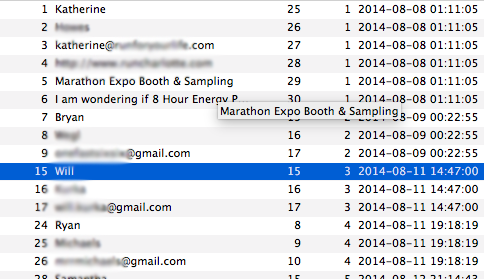

# 8 Hour Energy's Retrieval of Data
##--A Python To SQL Story--

### The Story:

I was hired by the company to do a data extraction of their Wordpress website.  I saw this as a new opportunity to work with Wordpress (a framework of which I was unfamiliar with) as well as a way for me to stretch the skills of my new found love, DATA!!  And not just any data, but the biggest dataset I've yet to work with (close to 430,000 entries in one table alone!)

Upon retreiving the data, it was abundantly clear that there were two large problems.  There was no form validation that enforced real emails, or a minimum amount of inputs and the queries written in the routes for the inputing of form data were not storing the data in a logical manner.  As you can see by this Screen Shot:

 

Not only were the first/last name and the email address stored in a single column, but three different forms were inputing data into the same database.  That means there were three different form input ID's attributed to the first/last name and email but some entries included up to six rows per unique entry ID!  The company stressed that they were only interested in the email addresses for their mailing list.  This allowed me to focus on retrieving only the data that was important for them.  Being the over-achiever that I am, I created two new tables.  One filled with all the relavant information (meaning that all the pertinent data from every entry was included [3 - 6 rows]) and another that included only the first/last name and email from every entry. 

My first task was to extract the data in a manner that I could organize it.  Luckily, each entry had a unique item_id so I grouped the data into a tuple by their item_id:

```Python
cursor.execute("SELECT T1.item_id, GROUP_CONCAT(T1.meta_value SEPARATOR ', ') AS Result FROM wp_kczafk_frm_item_metas T1 GROUP BY T1.item_id")
result = cursor.fetchall()
```

The following algorithm then loops through this selection and inputs the `result` into two new tables I previously created. (`email_list` and `just_email_list`)  `table_list` becomes an iterable list that the "j" loop iterates through to check whether or not every entry was filled out, and gives it a value of 'NULL' if anything has been left blank.  If the list contains an index of less than 3 items, it is automatically discarded with a silly message for myself to enjoy while I oversaw the extraction of this big database.  Otherwise, if the list was less than 6 (not everyone filled out every entry on the form) it would receive 'NULL' for it's value and if it was 6 every item would be input.  While this form was being populated the `just_email_list` was simultaneously being filled with only the data from the email column: `table_list[2]`

```Python
for i in range (0, len(result)):
    table_list = result[i][1].split(', ', 5)

    for j in range (0, len(table_list)):
        if table_list[j] is None:
            table_list[j] = 'NULL'

    if len(table_list) < 3:
        print "This Person Sucks Hambone"
    elif len(table_list) < 6:
        cursor.execute("INSERT INTO email_list (id, First_Name, Last_Name, Email, Website, Title, Message) VALUES (%r, %r, %r, %r, %r, %r, %r)", (result[i][0], table_list[0], table_list[1], table_list[2], 'NULL', 'NULL', 'NULL'))
    elif len(table_list) == 6:
        cursor.execute("INSERT INTO email_list (id, First_Name, Last_Name, Email, Website, Title, Message) VALUES (%r, %r, %r, %r, %r, %r, %r)", (result[i][0], table_list[0], table_list[1], table_list[2], table_list[3], table_list[4], table_list[5]))
    conn.commit()

    cursor.execute("INSERT INTO just_email_list VALUES (%s)", table_list[2])
    conn.commit()
```

I left any duplication check off my algorithm for the sake of speed.  It was originally included but the table went from being generated at over 1,000 rows per second to under 100 rows per second!  You can view this file [in this repo](../master/8hour2.py) I believe the problem here was O(n^2) as we were populating a list and then iterating over it again for every index.  

```Python
...
    elif len(table_list) == 6:
        cursor.execute("SELECT Email FROM email_list WHERE Email = %r", table_list[2])
        email_present = cursor.fetchone()
        if email_present is None:
            cursor.execute("INSERT INTO email_list (id, First_Name, Last_Name, Email, Website, Title, Message) VALUES (%r, %r, %r, %r, %r, %r, %r)", (result[i][0], table_list[0], table_list[1], table_list[2], table_list[3], table_list[4], table_list[5]))
...
```

I then thought of the fact that there may be entries in the database that consist of only a first name and an email address.  Or perhaps just an email address!  I took advantage of the unique input ID's I noticed in the beginning and wrote [this](../master/finalQuery.sql):

```SQL
INSERT INTO name_email_list (First_Name, Last_Name, Email, Count)
SELECT T1.meta_value AS First_Name, T2.meta_value AS Last_Name, T3.meta_value AS Email, COUNT(1) AS Count 
FROM (SELECT meta_value, field_id 
FROM wp_kczafk_frm_item_metas 
WHERE field_id = 25 
OR field_id = 15 
OR field_id = 8) AS T1
LEFT JOIN (SELECT meta_value, field_id 
FROM wp_kczafk_frm_item_metas 
WHERE field_id = 26 
OR field_id = 16 
OR field_id = 9) AS T2
ON T1.item_id = T2.item_id 
LEFT JOIN (SELECT meta_value, field_id 
FROM wp_kczafk_frm_item_metas 
WHERE field_id = 27 
OR field_id = 17 
OR field_id = 10) AS T3
ON T1.item_id = T3.item_id
GROUP BY First_Name, Last_Name, Email
ORDER BY Count DESC;
```
This was INFINITELY faster AND allowed me to lump any repeat entries together, while keeping a tally of how many times they were present!
